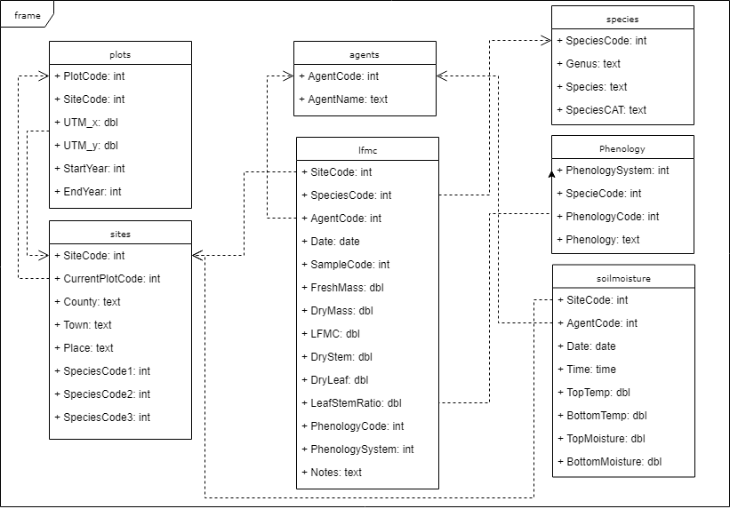

## Estructura de la base de dades

## Codificació de la fenologia

### Sistema 1

| Codi |	Estat fenològic |
|------|----------------------|
| 1	| Vegetació |
| 2	| Brotació |
| 3	| Floració |
| 4	| Fructificació |
| 5	| Maduració |

### Sistema 2

| Espècie | Codi | Estat fenològic           |
|--------|------|----------------------|
| Romaní | 10 |	S'han obert les primeres flors |
| Romaní | 01	 | Floració plena (aprox. 50% de les flors obertes, algunes caigudes) |
| Garric | 10	 | Floració plena (aprox. 50 % de les flors mostren els estams) | 
| Garric | 01  |	Glans mig madures (de color brunenc més o menys pujat i alguna ja ha caigut al terra)|
| Pi blanc |	10	| Presencia de flors masculines i femenines |
| Pi blanc	| 01	| 50% de les pinyes del primer any (les que encara estan tancades) de color marró |
| Estepa	| 100	| S'han obert les primeres flors |
| Estepa	| 010	| Floració plena (aprox. 50% de les flors obertes, força pètals al terra) |
| Estepa	| 001	| Fruits (capsules) a mig madurar (color marró), alguns oberts |
| Arboç	| 100	| S'han obert les primeres flors |
| Arboç	| 010	| Floració plena (50% de les flors obertes i alguna ja ha caigut) |
| Arboç	| 001	| Cireres d'arboç a mig madurar (de colors entre taronja i vermell pujat, i alguna ja ha caigut) |
