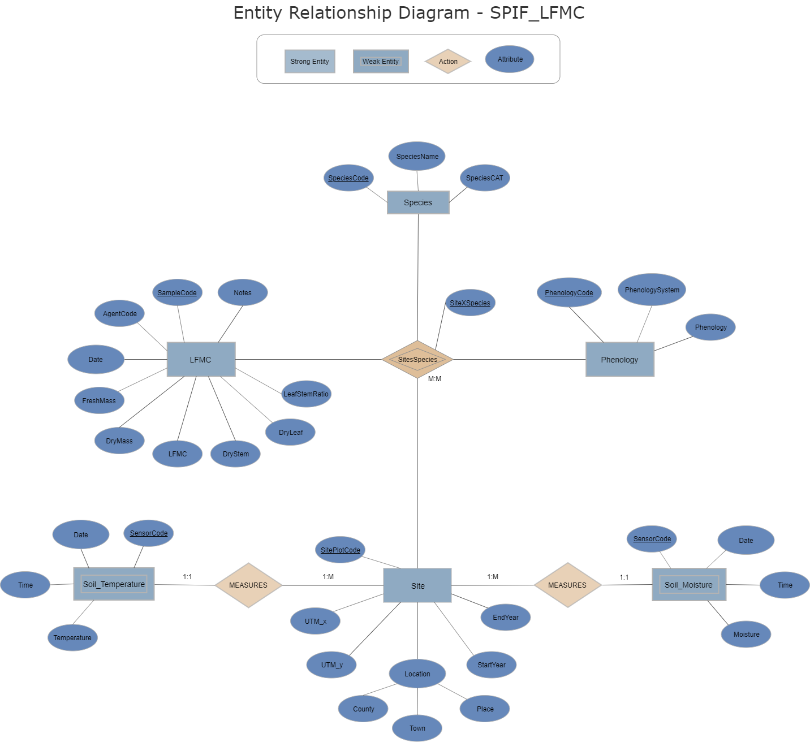
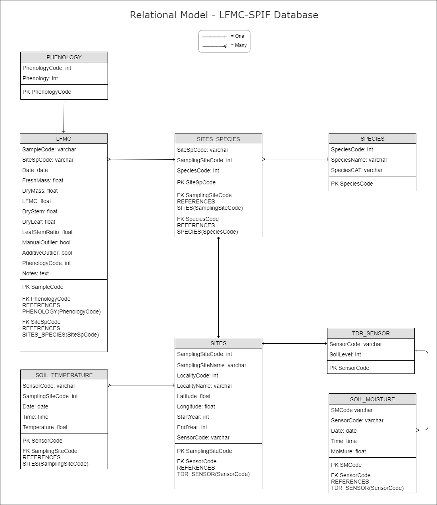

## Database design and structure 

{width=130%}

{width=130%}

## Data dictionary

The dictionary contains a description of the data included in the SPIF_LFMC database.  

Fields:

* Entity name
* Variable: variable names by entity
* Data type: sql data type per variable  
* Description: a brief description and data restrictions 
* Key 
  - Primary key: unique row id
  - Foreign key: column referencing the primary key from another entity (referenced entity)

| Entity           | Variable       |	Data type |  Description                                   | Key         |
|------------------|----------------|-----------|------------------------------------------------|-------------|
| SITES            | SitePlotcode   | varchar   | not null, unique, ZoneCode and SiteCode        | Primary Key |
|                  | UTM_x          | float     |                                                | NA          |
|                  | UTM_y          | float     |                                                | NA          |
|                  | ZoneCode       | integer   |                                                | NA          |
|                  | SiteCode       | integer   |                                                | NA          | 
|                  | ZoneName       | varchar   |                                                | NA          |
|                  | SiteName       | varchar   |                                                | NA          |
|                  | StartYear      | integer   | year the plot was started                      | NA          | 
|                  | EndYear        | integer   | year the plot was finalized                    | NA          | 
|                  | SensorCode     | varchar   | unique code for TDR sensor                     | Foreign Key | 
| SPECIES          | SpeciesCode    | integer   | not null, unique,                              | Primary Key |
|                  | SpeciesName    | varchar   | scientific name                                | NA          |
|                  | SpeciesCAT     | varchar   | catalan common name                            | NA          | 
| SITES_SPECIES    | SiteXSpecies   | varchar   | not null, unique, SitePlotCode and SpeciesCode | Primary Key |
|                  | SitePlotCode   | varchar   | not null                                       | Foreign Key |
|                  | SpeciesCode    | integer   | not null                                       | Foreign Key |
| LFMC             | SampleCode     | integer   | not null, unique                               | Primary Key |
|                  | SiteXSpecies   | varchar   | not null                                       | Foreign Key |
|                  | AgentCode      | integer   | LFMC data collector id                         | NA          | 
|                  | Date           | date      |                                                | NA          |
|                  | FreshMass      | float     |                                                | NA          | 
|                  | DryMass        | float     |                                                | NA          | 
|                  | LFMC           | float     |                                                | NA          | 
|                  | DryStem        | float     |                                                | NA          | 
|                  | DryLeaf        | float     |                                                | NA          | 
|                  | LeafStemRatio  | float     |                                                | NA          | 
|                  | PhenologyCode  | integer   |                                                | Foreign Key |
|                  | Notes          | text      |                                                | NA          | 
| PHENOLOGY        | PhenologyCode  | integer   | not null, unique                               | Primary Key |
|                  | PhenologySystem| integer   | old method = 1, current method = 2, for more details see the section 'Phenology coding' below | NA |
|                  | Phenology      | integer   |                                                | NA          | 
| SOIL_TEMPERATURE | SensorCode     | integer   | not null, unique                               | Primary Key |
|                  | SitePlotCode   | integer   | not null                                       | Foreign Key |
|                  | Date           | date      |                                                | NA          |
|                  | Time           | time      |                                                | NA          |
|                  | Temperature    | float     | soil temperature measured at different depths  | NA          |
| TDR_SENSOR       | SensorCode     | varchar   | not null, unique                               | Primary Key |
|                  | SoilLevel      | integer   |                                                | NA          |
| SOIL_MOISTURE    | SMCode         | integer   | not null, unique                               | Primary Key |
|                  | SensorCode     | integer   | not null, unique                               | Foreign Key |
|                  | Date           | date      |                                                | NA          |
|                  | Time           | time      |                                                | NA          |
|                  | Moisture       | float     | soil moisture measured at different depths     | NA          |

## Phenology coding

### System 1

| Codi |	Estat fenològic |
|------|----------------------|
| 1	| Vegetació |
| 2	| Brotació |
| 3	| Floració |
| 4	| Fructificació |
| 5	| Maduració |

### System 2

| Espècie | Codi | Estat fenològic           |
|--------|------|----------------------|
| Romaní | 10 |	S'han obert les primeres flors |
| Romaní | 01	 | Floració plena (aprox. 50% de les flors obertes, algunes caigudes) |
| Garric | 10	 | Floració plena (aprox. 50 % de les flors mostren els estams) | 
| Garric | 01  |	Glans mig madures (de color brunenc més o menys pujat i alguna ja ha caigut al terra)|
| Pi blanc |	10	| Presencia de flors masculines i femenines |
| Pi blanc	| 01	| 50% de les pinyes del primer any (les que encara estan tancades) de color marró |
| Estepa	| 100	| S'han obert les primeres flors |
| Estepa	| 010	| Floració plena (aprox. 50% de les flors obertes, força pètals al terra) |
| Estepa	| 001	| Fruits (capsules) a mig madurar (color marró), alguns oberts |
| Arboç	| 100	| S'han obert les primeres flors |
| Arboç	| 010	| Floració plena (50% de les flors obertes i alguna ja ha caigut) |
| Arboç	| 001	| Cireres d'arboç a mig madurar (de colors entre taronja i vermell pujat, i alguna ja ha caigut) |
