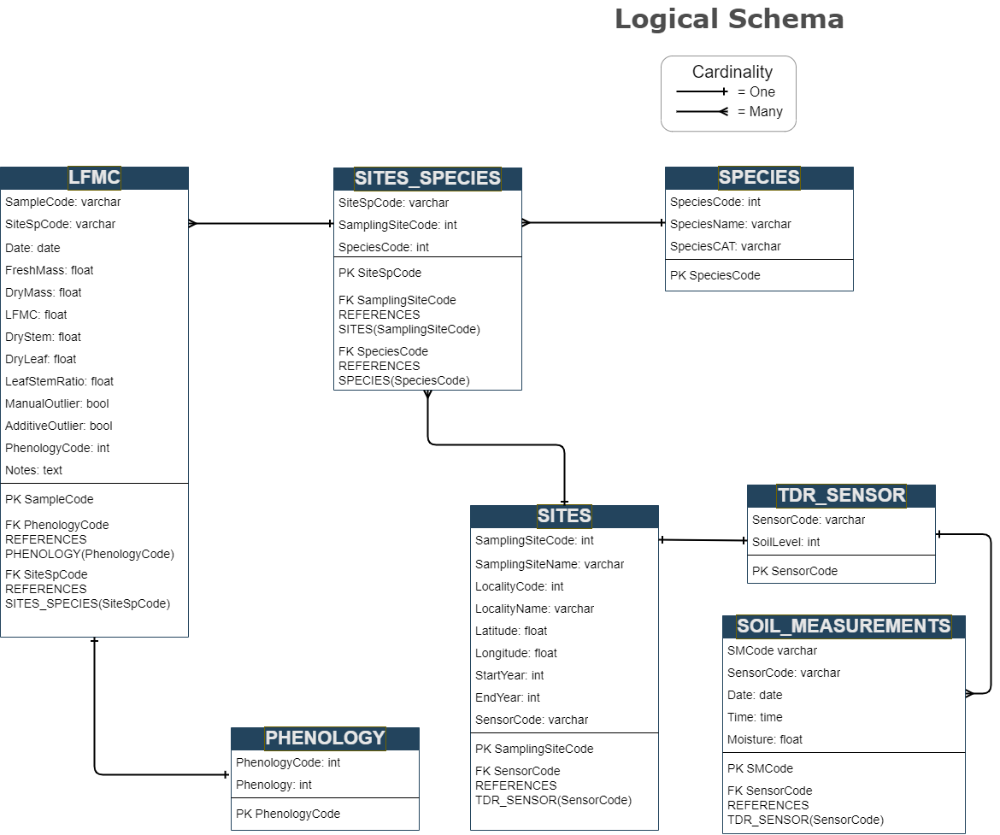

## Database design and structure 

{width=130%}

## Data dictionary

The dictionary contains a description of the data included in the SPIF_LFMC database.  

Fields:

* Entity name
* Variable: variable names by entity
* Data type: SQLite data type per variable  
* Description: a brief description and data restrictions 
* Key 
  - Primary key: unique row id
  - Foreign key: column referencing the primary key from another entity (referenced entity)

| Entity           | Variable         |	Data type |  Description                                                 | Key         |
|------------------|------------------|-----------|--------------------------------------------------------------|-------------|
| SITES            | SamplingSiteCode | integer   | not null, unique code to identify the sambpling site         | Primary Key |
|                  | SamplingSiteName | text      | name of the sampling site                                    | NA          |
|                  | LocalityCode     | integer   | unique code to identify the locality where  the sampling sites are located | NA          |
|                  | LocalityName     | text      | name of the locality                                         | NA          |
|                  | Latitude         | real      | geographic coordinates                                       | NA          |
|                  | Longitude        | real      | geographic coordinates                                       | NA          |
|                  | StartYear        | integer   | year when measurements started on the sampling site          | NA          | 
|                  | EndYear          | integer   | year when measurements started on the sampling site          | NA          | 
|                  | SensorCode       | text      | unique code for TDR sensor                                   | Foreign Key | 
| SPECIES          | SpeciesCode      | integer   | not null, unique code to identify the species                | Primary Key |
|                  | SpeciesName      | text      | scientific name                                              | NA          |
|                  | SpeciesCAT       | text      | catalan common name                                          | NA          | 
| SITES_SPECIES    | SiteSpCode       | text      | not null, unique                                             | Primary Key |
|                  | SamplingSiteCode | integer   | not null, unique value to identify the locality and the sampling site | Foreign Key |
|                  | SpeciesCode      | integer   | not null                                                     | Foreign Key |
| LFMC             | SampleCode       | text      | not null, unique value to identify the sample                | Primary Key |
|                  | SiteSpCode       | text      | not null                                                     | Foreign Key |
|                  | Date             | numeric   | sampling data                                                | NA          |
|                  | FreshMass        | real      | fresh weight of samples                                      | NA          | 
|                  | DryMass          | real      | dry weight of samples                                        | NA          | 
|                  | LFMC             | real      | derived attribute computed from FreshMass and DryMass (FM - DM / DM) | NA          | 
|                  | DryStem          | real      | stem component of DryMass measurement                        | NA          | 
|                  | DryLeaf          | real      | leaf component of DryMass measurement                        | NA          | 
|                  | LeafStemRatio    | real      | derived attribute computed from DryLeaf and DryStem          | NA          | 
|                  | ManualOutlier    | numeric   | a flag indicating LFMC outliers manually identified          | NA          |
|                  | AdditiveOutlier  | numeric   | a flag indicating LFMC additive outliers                     | NA          |
|                  | PhenologyCode    | integer   |                                                              | Foreign Key |
|                  | Notes            | text      |                                                              | NA          | 
| PHENOLOGY        | PhenologyCode    | integer   | not null, unique value to identify the phenological stage    | Primary Key |
|                  | PhenologySystem  | integer   | old method = 1, current method = 2, for more details see the section 'Phenology coding' below | NA |
|                  | PhenologicalStage| text      | description of the phenological stage                        | NA          | 
| TDR_SENSOR       | SensorCode       | text      | not null, unique value to identify the sensor                | Primary Key |
|                  | SoilLevel        | integer   | soil depth at which measurements are made                    | NA          |
| SOIL_MEASUREMENTS| SMCode           | text      | not null, unique                                             | Primary Key |
|                  | SensorCode       | text      | not null, unique                                             | Foreign Key |
|                  | Date             | numeric   |                                                              | NA          |
|                  | Time             | numeric   |                                                              | NA          |
|                  | Moisture         | real      | soil moisture measured at different depths                   | NA          |
|                  | Temperature      | real      | soil temperature measured at different depths                | NA          |

## Phenology coding

### System 1

| Codi |	Estat fenològic |
|------|----------------------|
| 1	| Vegetació |
| 2	| Brotació |
| 3	| Floració |
| 4	| Fructificació |
| 5	| Maduració |

### System 2

| Espècie | Codi | Estat fenològic           |
|--------|------|----------------------|
| Romaní | 10 |	S'han obert les primeres flors |
| Romaní | 01	 | Floració plena (aprox. 50% de les flors obertes, algunes caigudes) |
| Garric | 10	 | Floració plena (aprox. 50 % de les flors mostren els estams) | 
| Garric | 01  |	Glans mig madures (de color brunenc més o menys pujat i alguna ja ha caigut al terra)|
| Pi blanc |	10	| Presencia de flors masculines i femenines |
| Pi blanc	| 01	| 50% de les pinyes del primer any (les que encara estan tancades) de color marró |
| Estepa	| 100	| S'han obert les primeres flors |
| Estepa	| 010	| Floració plena (aprox. 50% de les flors obertes, força pètals al terra) |
| Estepa	| 001	| Fruits (capsules) a mig madurar (color marró), alguns oberts |
| Arboç	| 100	| S'han obert les primeres flors |
| Arboç	| 010	| Floració plena (50% de les flors obertes i alguna ja ha caigut) |
| Arboç	| 001	| Cireres d'arboç a mig madurar (de colors entre taronja i vermell pujat, i alguna ja ha caigut) |
